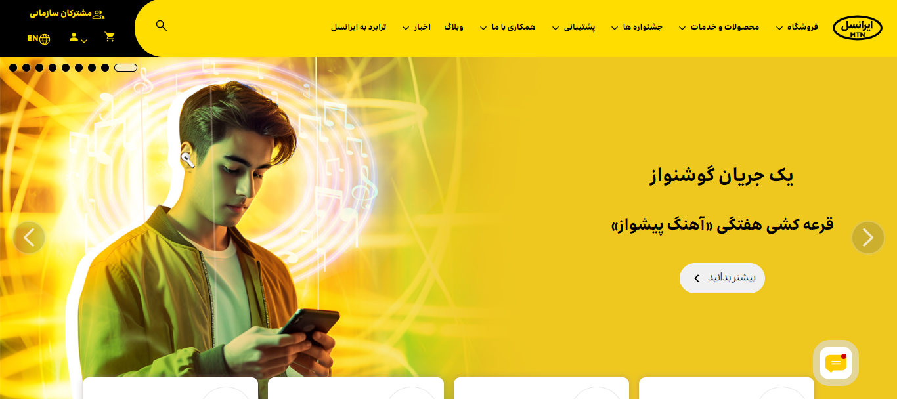

# 
My irancell project

<h3 align="center"><a href="https://negar-karimnejad.github.io/irancell/" target="_blank">You can see this repo online💡</a></h3>

<section width="100%" display="flex" align="center" justify-content="center" gap="2rem">

  

</section>

